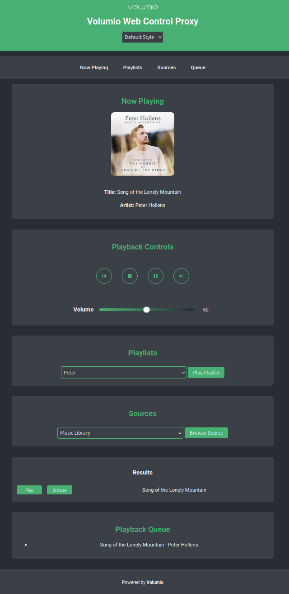

# Volumio Web Control Proxy

A standalone, lightweight web-based control interface for [Volumio](https://volumio.org/), acting as a proxy substitute for users who need a functional web control interface behind a reverse proxy setup.

## Overview

Volumio's native UI is not reverse-proxy compatible. This project solves that limitation by offering a simplified and extensible control interface that communicates with Volumio's REST API.

<p align="center">
  
</p>

### Features

- **Playback Controls:** Play, pause, stop, next, previous, and volume control.
- **Now Playing:** Real-time display of the current track, including album art.
- **Queue Management:** Add, reorder, and remove items from the playback queue.
- **Source Browsing:** Explore and play content from multiple sources.
- **Playlist Support:** Select and play user-created playlists.
- **Web Radio Support:** Play and manage web radio streams.

---

### Project Goals

- **Ease of Use:** Simplified UI for key Volumio functions.
- **Customizability:** Fully customizable HTML, CSS, and JS.
- **Future Development:** Extensible architecture to incorporate advanced API features.

---

## Getting Started

### Prerequisites

1. A running Volumio instance on your network.
2. A web server (Apache, Nginx) or Docker installed on your host machine.

---

## Installation

#### Option 1: Using a Web Server

1. Clone this repository:

   ```bash
   git clone https://github.com/yourusername/volumio-web-control-proxy.git
   cd volumio-web-control-proxy
   ```

2. Copy the contents of `src/` to your web server's document root (e.g., `/var/www/html/`):

   ```bash
   sudo cp -r src/* /var/www/html/
   ```

3. Start the web server and ensure it serves the files.

4. Open your browser and navigate to `http://your_server_ip/`.

---

#### Option 2: Using Docker

1. Navigate to the project root directory:

   ```bash
   cd volumio-web-control-proxy
   ```

2. Build the Docker image:

   ```bash
   docker build -t volumio-web-control-proxy .
   ```

3. Start the container:

   ```bash
   docker run -d -p 8080:80 --name volumio-web-control-proxy volumio-web-control-proxy
   ```

4. Open your browser and navigate to `http://your_docker_host_ip:8080/`.

---

## Configuration

### Setting Up Reverse Proxy

This project includes configuration files for both Apache and Nginx to serve the web control interface.

#### Placeholder `<volumio_ip>`

The `<volumio_ip>` placeholder in the `volumio.conf` files must be replaced with the IP address of your Volumio device. This allows the reverse proxy to forward API requests to the Volumio device.

To find your Volumio device's IP address, you can:

1. Check your router's connected devices list.
2. Use a network scanner like `nmap`.
3. Access Volumio's settings through its native interface, where the IP address is displayed.

For example:

```nginx
proxy_pass http://192.168.1.100:3000;  # Replace 192.168.1.100 with your Volumio IP
```

```apache
ProxyPass /api/v1 http://192.168.1.100:3000/api/v1
ProxyPassReverse /api/v1 http://192.168.1.100:3000/api/v1
```

#### Configuring and Enabling the Reverse Proxy

1. Update the `<volumio_ip>` placeholder in the configuration file.
2. Copy the configuration file to your server's configuration directory:
   - **Apache**: `/etc/apache2/sites-available/volumio.conf`
   - **Nginx**: `/etc/nginx/sites-available/volumio.conf`
3. Enable the site:
   ```bash
   # Apache
   sudo a2ensite volumio.conf
   sudo systemctl reload apache2
   
   # Nginx
   sudo ln -s /etc/nginx/sites-available/volumio.conf /etc/nginx/sites-enabled/
   sudo systemctl reload nginx
   ```
4. Test your setup by navigating to the URL or IP where your proxy is hosted.

## Usage

1. Open the web interface in your browser.
2. Use the navigation menu to switch between "Now Playing", "Playlists", "Sources", and "Queue".
3. Enjoy controlling your Volumio device!

---

### Contributing

We welcome contributions! Please open issues or submit pull requests for:

- Bug fixes.
- New features.
- UI/UX improvements.

---

### License

This project is licensed under the MIT License. See the [LICENSE](LICENSE) file for details.

---

## Acknowledgments

- Inspired by the [Volumio Community](https://community.volumio.org/).
- Thanks to the contributors who helped refine this project.

---

## Repository Structure

```
volumio-web-control-proxy/
├── README.md
├── LICENSE
├── src/
│   ├── index.html
│   ├── script.js
│   ├── style.css
│   ├── style_alt.css
│   ├── favicon.ico
│   ├── assets/
│   │   └── volumio-logo.png
├── docker/
│   ├── Dockerfile
│   ├── docker-compose.yml
├── server/
│   ├── apache/
│   │   └── volumio.conf
│   └── nginx/
│       └── volumio.conf
└── docs/
    └── screenshots/
        └── screenshot1.png
```

---

## Suggested Development Directions

1. **Enhanced API Integration:** Extend the interface to include advanced Volumio features, such as Tidal Connect or Spotify Connect.
2. **WebSocket Support:** Add support for Volumio's WebSocket API for real-time updates.
3. **Theme Customization:** Allow users to choose between light and dark themes or customize colors.
4. **Mobile Optimization:** Improve responsiveness for seamless mobile experience.
5. **Third-Party Plugins:** Add support for popular third-party plugins via the interface.

---

## Versioning Information

- **Project Version:** 1.0.2
- **Compatible Volumio Versions:** 3.x and above

### Changelog

#### v1.0.2
- Improvements:
  - Style switch
  - New modern style

#### v1.0.1
- Improvements:
  - Playback controls
  - Volume state
  - Style correction

#### v1.0.0
- Initial release with:
  - Playback controls
  - Source browsing
  - Playlist support
  - Web radio support
  - Docker and reverse proxy configuration
